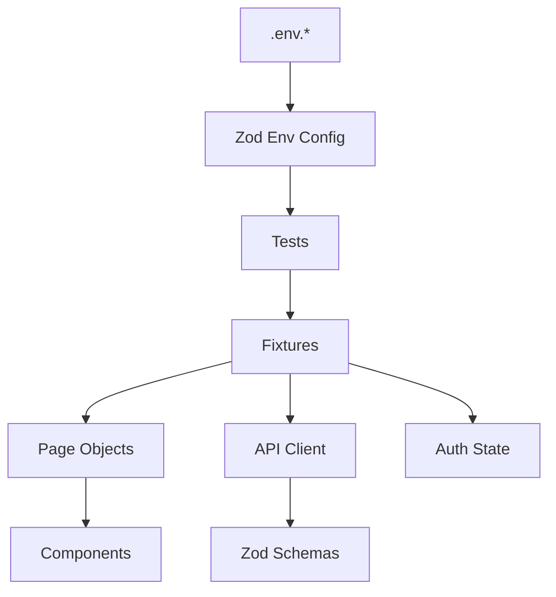
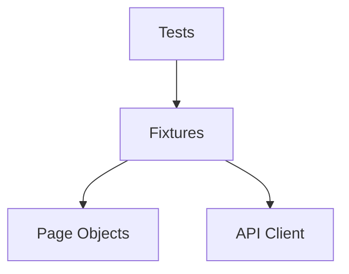

# Day 28 — Portfolio Polish

> **Goal:** Biến repo học tập thành **portfolio chuyên nghiệp** — người recruiter xem hiểu ngay tại sao hire bạn.
> **Thời gian:** 3-4 giờ

---

## Prerequisites

- 27 ngày trước đã xong
- Repo có ≥ 25 commit, CI xanh

---

## 1. Recruiter xem gì trong 60 giây?

Research shows:

1. README (title, description, badges) — 10s
2. File tree glance — 5s
3. CI status — 5s
4. Live demo link (if any) — 10s
5. 1 test file (đọc code quality) — 30s

**→ Đầu tư vào 5 chỗ này.**

---

## 2. README.md portfolio-grade

### Structure template

````markdown
# Playwright Learning Journey

> E2E + API + Visual + A11y + Performance test automation for [App Name]
> Built from scratch in 30 days as a manual tester learning automation.


**[📊 Live Test Report](https://user.github.io/playwright-learning-journey/)** | **[📝 Blog: My 30-day Journey](https://dev.to/...)**

---

## 🎬 Demo


---

## 🧱 Tech Stack

| Layer      | Tool                                     |
| ---------- | ---------------------------------------- |
| Framework  | Playwright 1.59                          |
| Language   | TypeScript 5 (strict)                    |
| Assertions | `expect` (web-first)                     |
| API        | `APIRequestContext` + Zod                |
| Data       | `@faker-js/faker`                        |
| Config     | `dotenv` + Zod validation                |
| Reporting  | HTML + Allure + JUnit                    |
| Quality    | ESLint 9 + Prettier + Husky + Commitlint |
| CI         | GitHub Actions (4 shards matrix)         |
| Container  | Docker (Playwright official image)       |

---

## 🏗️ Architecture


````

---

## 📁 Project Structure

<details>
<summary>Click to expand</summary>

```
playwright-learning-journey/
├── .github/workflows/     # CI: lint gate + 4 shards + merge + deploy
├── .claude/               # Slash commands, hooks, subagents
├── src/
│   ├── pages/             # POM
│   ├── components/        # Reusable UI objects
│   ├── fixtures/          # Test fixtures (DI)
│   ├── api/               # Typed API client + endpoints
│   ├── helpers/           # logger, wait, data-factory
│   ├── config/            # env.ts (Zod validated)
│   └── data/              # Static JSON fixtures
├── tests/
│   ├── e2e/               # End-to-end
│   ├── api/               # API-only
│   ├── visual/            # Snapshot tests
│   ├── a11y/              # axe-core
│   └── performance/       # Core Web Vitals budgets
├── Dockerfile
├── playwright.config.ts
├── tsconfig.json          # strict mode + path aliases
└── package.json
```

</details>

---

## 🚀 Quick Start

```bash
git clone https://github.com/user/repo
cd playwright-learning-journey
npm install
npx playwright install
cp .env.example .env.dev
npm test
npm run report
```

---

## 📜 Scripts

| Script                  | Purpose                           |
| ----------------------- | --------------------------------- |
| `npm test`              | Run all tests (default: chromium) |
| `npm run test:ui`       | Open Playwright UI mode           |
| `npm run test:debug`    | Debug with Inspector              |
| `npm run test:smoke`    | Smoke suite only                  |
| `npm run test:staging`  | Run against staging env           |
| `npm run report`        | Open HTML report                  |
| `npm run report:allure` | Generate & serve Allure           |
| `npm run lint`          | Lint TypeScript                   |
| `npm run typecheck`     | Type check                        |
| `npm run check`         | Full gate (lint + type + format)  |

---

## 📊 Test Coverage

| Type           | Count  | Examples                           |
| -------------- | ------ | ---------------------------------- |
| E2E smoke      | 8      | Login, signup, checkout happy path |
| E2E regression | 15     | Cart edit, search, filter          |
| API            | 12     | CRUD users, auth, error cases      |
| Visual         | 5      | Home, product, checkout            |
| A11y           | 4      | WCAG 2.1 AA on critical pages      |
| Performance    | 3      | LCP / FCP budgets                  |
| **Total**      | **47** |                                    |

---

## 🤖 AI Workflow

This project was built with AI pair-programming using Claude Code.
See [AI_WORKFLOW.md](./AI_WORKFLOW.md) for prompt templates and rules I follow.

---

## 📚 Learning Journey

30-day log: [NOTES.md](./NOTES.md)
Blog post: [Link]

---

## 📝 License

MIT

````

---

## 3. Badges — where to get

- [shields.io](https://shields.io/) — any badge
- GitHub Actions badge: `https://github.com/user/repo/actions/workflows/FILE.yml/badge.svg`
- Custom color/label in shields.io generator

---

## 4. Demo GIF

**Tool:** [LICEcap](https://www.cockos.com/licecap/) (free, cross-platform) hoặc [Kap](https://getkap.co/) (macOS)

**Workflow:**
1. Run a flashy test (UI mode, multi-browser, parallel)
2. Record 15-30s max
3. Save as GIF (< 5MB)
4. Commit to `docs/demo.gif`
5. Link in README

**Alternative:** Video MP4 upload to GitHub → embed via [GitHub's CDN](https://docs.github.com/en/get-started/writing-on-github/working-with-advanced-formatting/attaching-files).

---

## 5. Deploy Allure report (public link)

Add to `.github/workflows/playwright.yml`:

```yaml
permissions:
  contents: read
  pages: write
  id-token: write

jobs:
  # ... existing jobs ...

  deploy-report:
    if: always()
    needs: merge-reports
    runs-on: ubuntu-latest
    environment:
      name: github-pages
      url: ${{ steps.deployment.outputs.page_url }}
    steps:
      - uses: actions/download-artifact@v4
        with: { name: html-report, path: report }
      - uses: actions/configure-pages@v4
      - uses: actions/upload-pages-artifact@v3
        with: { path: report }
      - id: deployment
        uses: actions/deploy-pages@v4
````

Enable: Settings → Pages → Source: "GitHub Actions".

URL: `https://<user>.github.io/<repo>/`

---

## 6. Self code review

Go through repo với critical eye:

### Tests

- [ ] Tên test rõ ràng (`"user can add item to cart"` không phải `"test 1"`)
- [ ] No `console.log` quên
- [ ] No `test.only()` / `test.skip()` quên
- [ ] Every test pass `--workers=4`
- [ ] All tags consistent

### Page Objects

- [ ] Mỗi method có tên business, không technical
- [ ] No assertions trong POM (trừ state checks)
- [ ] Locator readonly

### Code Quality

- [ ] No `any` types (hoặc eslint disable với lý do)
- [ ] No TODO vô nghĩa
- [ ] Imports sort, no unused
- [ ] File < 300 lines

### Git

- [ ] Commits follow Conventional Commits
- [ ] No `WIP` commits on main
- [ ] No `.env.*` leaked
- [ ] `.gitignore` comprehensive

### Docs

- [ ] README readable trong 2 phút
- [ ] Screenshots/diagrams
- [ ] Links active (not broken)

---

## 7. LinkedIn post template

```
🎯 Just wrapped 30 days of learning Playwright automation as a manual tester!

Built from scratch:
→ 47 tests across 5 types (E2E, API, Visual, A11y, Performance)
→ CI/CD with 4 parallel shards
→ Docker-containerized
→ Multi-environment (dev/staging)
→ AI pair-programmed with Claude Code

Biggest "aha" moments:
1. Locator priority (role > label > testId) — dramatic flakiness reduction
2. Storage state vs login-per-test — 10x speed improvement
3. Web-first assertions replace every `waitForTimeout`
4. AI is a force multiplier — if you know what you're doing

Stack:
Playwright 1.59 • TypeScript 5 strict • Zod • Faker • Allure • Docker • GitHub Actions

Full repo + blog post:
[GitHub link]
[Dev.to post link]

Next: Contract testing with Pact + load testing with k6.

Open to feedback from automation folks! 🙏

#playwright #automation #qa #testing #softwaretesting
```

---

## 8. Dev.to / Medium blog post

### Outline

1. **Intro** — manual tester, 30 days, why automation now (AI era)
2. **Stack choice** — why Playwright over Selenium/Cypress
3. **Weekly breakdown** — 1 paragraph per week
4. **3 non-obvious lessons** — deep insights
5. **AI workflow** — how it helped (and didn't)
6. **What's next** — honest assessment

### Tips

- Images/GIFs every 3-4 paragraphs
- Code snippets (syntax-highlighted)
- 1000-2000 words
- Publish on [dev.to](https://dev.to) for reach

---

## 9. Bài tập

### Bài 1: README rewrite

Follow template mục 2. Populate bạn's data. Get 1 friend review.

### Bài 2: Record demo GIF

15-30s showing test suite run + report. Commit to repo.

### Bài 3: Deploy Allure

Enable GitHub Pages. Deploy report. Link in README works.

### Bài 4: Self-review checklist

Go through mục 6. Fix everything. Force-push nothing yet.

### Bài 5: Blog post draft

Write 500 words. Publish on dev.to ngày mai (Day 30).

---

## 10. Common Pitfalls

| Vấn đề                      | Fix                                              |
| --------------------------- | ------------------------------------------------ |
| README quá dài (>500 lines) | Move details to separate docs                    |
| Demo GIF 10MB               | Reduce fps/resolution hoặc crop                  |
| Badges broken               | Check URL format on shields.io                   |
| Allure report 404           | Pages source = Actions, workflow permissions set |
| Dev.to post no engagement   | Add tags: #playwright #testing #webdev           |

---

## 11. Anti-patterns

- ❌ Over-claim skills ("expert in X after 30 days")
- ❌ Paste job description as README
- ❌ Emoji spam in README
- ❌ Inflate test count (count `beforeEach` as test)
- ❌ Fake CI green (fake screenshot)

**Stay honest.** Recruiter có eye cho BS.

---

## 12. Checklist

- [ ] README portfolio-grade
- [ ] Demo GIF/video
- [ ] Badges: CI, Node, Playwright, TS
- [ ] Live Allure report deployed
- [ ] Architecture diagram (mermaid)
- [ ] Self-review 6 criteria all pass
- [ ] Blog post draft 500+ words
- [ ] LinkedIn post scheduled
- [ ] Commit: `docs: portfolio polish`

---

## Resources

- [Shields.io](https://shields.io/) — badges
- [LICEcap](https://www.cockos.com/licecap/) — GIF recorder
- [Mermaid diagrams](https://mermaid.js.org/) — architecture diagrams in markdown
- [Make a README](https://www.makeareadme.com/)
- [GitHub — Deploy Pages](https://docs.github.com/en/pages/getting-started-with-github-pages/creating-a-github-pages-site)

---

## 📚 Tài liệu mở rộng — Đào sâu chủ đề

### 🎥 Video tutorials

- [How to write a stellar README (GitHub)](https://www.youtube.com/watch?v=E6NO0rgFub4)
- [Portfolio projects for developers](https://www.youtube.com/results?search_query=developer+portfolio+projects)
- [Mermaid diagrams tutorial](https://www.youtube.com/results?search_query=mermaid+diagrams)

### 📝 Articles & blogs

- [GitHub — Profile README ideas](https://dev.to/search?q=github+profile+readme)
- [Awesome READMEs (curated)](https://github.com/matiassingers/awesome-readme)
- [How to get hired — engineer portfolio](https://www.freecodecamp.org/news/how-to-build-portfolio-website/)
- [Kent C. Dodds — How I built my portfolio](https://kentcdodds.com/)

### 🎓 Portfolio patterns

- [Showcase template (Dribbble)](https://dribbble.com/)
- [Readme-ai (auto-generate)](https://github.com/eli64s/readme-ai)
- [README Best Practices](https://bulldogjob.com/news/449-how-to-write-a-good-readme-for-your-github-project)

### 📖 Books

- _Building a Second Brain_ — Tiago Forte (document your work)
- _The Passionate Programmer_ — Chad Fowler (career development)

### 🐙 Related GitHub repos

- [othneildrew/Best-README-Template](https://github.com/othneildrew/Best-README-Template)
- [matiassingers/awesome-readme](https://github.com/matiassingers/awesome-readme)
- [Search top starred Playwright repos](https://github.com/search?q=playwright+test&type=repositories&s=stars)
- [bxb100/readme-ai](https://github.com/eli64s/readme-ai) — auto-generate

### 🛠️ Tools

- [Shields.io](https://shields.io/) — badges
- [LICEcap](https://www.cockos.com/licecap/) — GIF record macOS+Windows
- [Kap](https://getkap.co/) — macOS screen record
- [OBS Studio](https://obsproject.com/) — professional recording
- [Loom](https://www.loom.com/) — cloud share
- [Mermaid Live Editor](https://mermaid.live/) — diagrams online
- [Excalidraw](https://excalidraw.com/) — hand-drawn style diagrams
- [carbon.now.sh](https://carbon.now.sh/) — beautiful code screenshots

### 📊 Cheat sheets

- [Markdown cheatsheet](https://www.markdownguide.org/cheat-sheet/)
- [GitHub-flavored markdown](https://docs.github.com/en/get-started/writing-on-github/getting-started-with-writing-and-formatting-on-github/basic-writing-and-formatting-syntax)
- [Mermaid syntax cheatsheet](https://mermaid.js.org/intro/syntax-reference.html)

---

## 🎯 Thực hành mở rộng — Challenge exercises

### 🟢 Cơ bản (README quality)

**B1.** Rewrite README theo template. Include:

- Title + 1-line description
- Badges (CI, Node, Playwright, license)
- Demo GIF/image
- Tech stack
- Quick start
- Scripts table
- Link blog post (placeholder)

**B2.** Architecture diagram với Mermaid:



Embed trong README.

**B3.** Demo GIF — record 15s suite chạy. Commit `docs/demo.gif`. Link trong README.

### 🟡 Trung bình (deploy reports)

**M1.** GitHub Pages deploy HTML report:

- Enable Pages
- Workflow deploys `playwright-report/` to Pages
- Link in README works

**M2.** Allure report history:

```yaml
- uses: simple-elf/allure-report-action@v1
  with:
    allure_results: allure-results
    gh_pages: gh-pages
    keep_reports: 20
```

Historical dashboard working.

**M3.** Badges — realistic + dynamic:

```markdown


```

**M4.** README in 2 languages — EN + VI. Show international audience.

### 🔴 Nâng cao (professional polish)

**A1.** Self-code-review — print full diff of 30-day repo:

```bash
git log --oneline
git diff $(git rev-list --max-parents=0 HEAD)..HEAD
```

Identify 5 things cringe. Refactor.

**A2.** Blog post draft — 1000 words "30 Days Learning Playwright":

- Hook (200)
- Weekly breakdown (400)
- 3 key lessons (200)
- Next steps (200)

Get 1 friend review. Publish.

**A3.** LinkedIn optimization:

- Headline: "Automation Tester | Playwright + AI workflow"
- Featured: pin repo + blog
- About: 3-paragraph journey
- Skills: add Playwright, TS, etc.

Post update with screenshot. Get 50 reactions.

**A4.** Open source presence:

- Star 20 relevant repos (creates public trail)
- Comment on 2 issues (thoughtful)
- Watch Playwright org

### 🏆 Mini challenge (90 phút)

**Task:** Portfolio-ready package:

Deliver:

- ✅ README portfolio-grade (follows template)
- ✅ Demo GIF (quality, <5MB)
- ✅ Architecture diagram (mermaid)
- ✅ Live Allure report (GitHub Pages URL)
- ✅ Blog post published (dev.to)
- ✅ LinkedIn post + profile optimized
- ✅ Pin repo on GitHub profile
- ✅ Screenshot of green CI (in README)
- ✅ Tagged release v1.0

Review with fresh eyes next day — edit.

### 🌟 Stretch goal

Submit portfolio to [Hacker News Show HN](https://news.ycombinator.com/show) — real feedback from engineers.

---

## Next

[Day 29 — Interview Prep →](./day-29-interview-prep.md)
